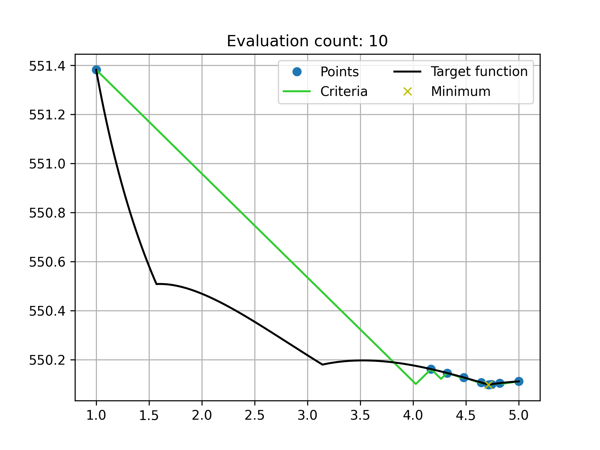

# Homogeneous algorithms testing framework

## Black-box function optimization

In optimization we often encounter functions whose properties are highly unknown.
We don't know anything about the graph, local minimums, range of values, etc. 
What we do have is the rule that allows us to calculate function values.
Such functions seem to be susceptible to brute force only.
Because optimizations highly depend on the information given, we still need assumptions to make progress.
One of the common assumptions for black-box functions is their Lipshitz continuity.

## Homogenuous algorithms

An optimization algorithm is called **homogenuous** if it generates same test points for functions in the set $\{f(x)+c \ |\  c \in \mathbb{R}\}$.
Homogenuous algorithms are independent of the range of values.

There are several approaches, the most common is the following.
Let $D=[a,b]$ be the domain and $M = \{x_0, ..., x_n\}$ the set of starting points. Then optimization goes like this:
1) $\forall x_i\in M$ calculate $f(x_i)$, set $k:=n$
2) Build $m_k(x), s_k(x)$
3) Build $P_k(x)=m_k(x)-s_k(x)$
4) Calculate $x_{k+1} = \arg\min\limits_{x\in D} \ P_k(x)$
5) Calculate $f(x_{k+1})$
6) if some  condition $\phi(x|x_0,...,x_k)$ is met then stop, else $k:=k+1$ and go to step 2 

Take $x^* = \arg\min\limits_{i=\overline{1,k}} f(x_i)$, $f^* = f(x^*)$ as solution

### Modeling process
$m(x)$ interpolates the target function

1) $m(x_i) = f(x_i), \ i= \overline{1,k}$
2) $m(x) \in Lip(L_m)$
3) $m(x_i \ |\  x_1, f(x_1) + c, ..., x_k, f(x_k) + c) = m(x_i \ |\  x_1, f(x_1), ..., x_k, f(x_k)) + c$

$s(x)$ is the measure of uncertainty. Intuitively it dictates how much do we not know about target function at a given point

1) $s(x_i) = 0$
2) $s(x) \geq 0$
3) $s(x) \in Lip(L_s)$
4) $s(x \ | \ x_1, f(x_1) + c, ..., x_k, f(x_k) + c) = s(x \ |\  x_1, f(x_1), ..., x_k, f(x_k))$

$P(x)$ is the minimum criteria. It's global minimum dictates the most uncertainty in the model of a target function, thus giving a potential candidate point to calculate.

## Lipshitz constant estimation
To perform optimization Lipshitz constant must be known, since function graph can easily be bounded.
If it is known then optimization becomes significantly faster. The speed depends on whether it is given globally or locally, because the latter is highly preferable.
If the constant is *not* known (which is the most common case), then it can be estimated at each iteration.

After points $\{ (x_i,y_i) \}_{i=0}^{k}$ have been evaluated, for each interval $[x_{i-1}, x_i], i=\overline{1,k},$ calculate
$$\lambda_i = max \left\{ \frac{|y_j - y_{j-1}|}{x_j - x_{j-1}} \mid j=i-1,i,i+1 \right\}$$
$$\lambda^{max} = \max\limits_{1\leq i\leq k}\frac{|y_i-y_{i-1}|}{x_i-x_{i-1}}$$
$$X^{max} = \max\limits_{1\leq i\leq k} \{ x_i - x_{i-1}\}$$
$$\gamma_i = \lambda^{max} \frac{(x_i - x_{i-1})}{X^{max}}$$
$$H_i = max \{\gamma_i, \lambda_i, \xi\}$$

for $i=1$ or $i=k$ in $\lambda_i$ only $j=i,i+1$ and $j=i-1,i$ are used respectively.

Lipshitz constant estimate on each interval is $\mu_i = rH_i, i=\overline{1,k}$
$r>1$ is a "reserve" parameter. It is recommended to choose $1.1\leq r \leq1.4$.

## Algorithms
### NL[^1]
Classic Piyavskiy[^2] algorithm but without Lipshitz constant known apriori.
It is estimated during optimization.

### CubicSplineGrad: 
$m(x)$ is a cubic spline interpolator (clamped edge constraints).
1) $x_0 = f(a), x_1 = f(b), k:=2 $
2) Estimate Lipshitz constants $\mu_i$ on each interval 
3) Interpolate points $\{ (x_i,y_i) \}_{i=0}^{k}$ with $m(x)$
4) For every interval $[x_{i-1}, x_i], \ i=\overline{1,k} $ calculate 
$$m_{left}^i = m_k^{'}(x_{i-1})$$ 
$$m_{right}^i = m_k^{'}(x_i)$$
5) Smooth derivative values with theta function $\theta(x)$ for every interval 
$$\theta_{left}^i = \theta(m_{left}^i)$$
$$\theta_{right}^i = \theta(m_{right}^i)$$
6) For every interval calculate
$$Q=\frac{y_i-y_{i-1}}{x_i-x_{i-1}}$$
if $Q\geq 0$ then
$$ \mu_{left} = max \{ \theta_{left}^i \mu_i, \xi\}$$
$$ \mu_{right} = max \{ \theta_{right}^i \mu_i, Q+\xi\}$$
else
$$ \mu_{left} = max \{ \theta_{left}^i \mu_i, -Q + \xi\}$$
$$ \mu_{right} = max \{ \theta_{right}^i \mu_i, \xi\}$$
obtain $s_k(x) = \min\limits_{i=\overline{1,k}}\{ \mu_{left}(x-x_{i-1}), \mu_{right}(x_i-x)\}$
7) $x_{k+1}=\arg\min\limits_{x\in D}P_k(m_k(x), s_k(x)), \ k:=k+1$
8) if $\min\limits_{i=\overline{1,k}}|x_{k+1}-x_i|<\epsilon$, where $\epsilon$ is tolerance, then stop, else go to step 2. 

### CubicSpline
Same as CubicSplineGrad except there's no step 5, i.e $\theta_{left}^i$ and $\theta_{right}^i$ are always 1.

### GradNL
Same as CubicSplineGrad except that $m_k(x)$ is used only for derivative values.
Interpolant is not used directly in search criteria $P(x)$, 
i.e $s_k(x) = m_k(x) - L(x)$, where $L(x) - $ is Lipshitz's minorant.
$$ L(x) = \max\limits_{x\in D}\{ y_{i-1} - L_{left}(x-x_{i-1}), y_i - L_{right}(x_i - x)\} $$
$$ i=\overline{1,k}$$

### QradNL
Same as GradNL except that minorants are quadratic 
$$ L(x) = \max\limits_{x\in D}\left\{ y_{i-1} - L_{left}\frac{(x-x_{i-1})^2}{x_i-x_{i-1}}, y_i - L_{right}\frac{(x_i - x)^2}{x_i-x_{i-1}}\right\} $$
$$ i=\overline{1,k}$$

## $\theta$ function
$\theta(x,\alpha,\beta)$ is a monotonic function that maps derivative values from range $(-\infty, +\infty)$ to $[0,\alpha]$.
It adheres to properties below:
1) $\theta(0) = 1$
2) $\lim\limits_{x\to -\infty}\theta(x) = a$
3) $\lim\limits_{x\to +\infty}\theta(x) = 0$
4) $\theta(x)$ is monotonically increasing

To be more precise it is a family of functions of two parameters $\alpha,\beta$.
$\alpha$ defines the ceiling, when $\beta$ defines the rate of change.
A convenient but yet not simple definition, used in the algorithms, is
$$ 
\theta(x,\alpha,\beta) =
\begin{cases} 
    \frac{2}{\pi}arctan\left(\frac{(\alpha-1)x}{\beta}\right) + 1, & x\geq 0 \\
    \frac{2(\alpha-1)}{\pi}arctan\left( \frac{x}{\beta}\right) + 1, & x\leq 0
\end{cases}$$

This definition gives a smooth $\theta$ function satisfying properties above.

## Results (evaluation count comparison)
| Function | NL   | CubicSpline | CubicSplineGrad | GradNL | QradNL |
|----------|------|-------------|-----------------|--------|--------|
| 1        | 23   | 24          | 13              | 13     | 13     |
| 2        | 25   | 28          | 28              | 23     | 18     |
| 3        | 89   | 86          | 46              | 60     | 59     |
| 4        | 29   | 32          | 32              | 30     | 24     |
| 5        | 33   | 37          | 33              | 26     | 29     |
| 6        | 42   | 43          | 45              | 41     | 39     |
| 7        | 26   | 27          | 28              | 23     | 26     |
| 8        | 75   | 86          | 52              | 54     | 34     |
| 9        | 24   | 31          | 30              | 26     | 25     |
| 10       | 27   | 31          | 29              | 28     | 25     |
| 11       | 45   | 50          | 50              | 41     | 40     |
| 12       | 36   | 46          | 48              | 34     | 34     |
| 13       | 32   | 36          | 37              | 49     | 28     |
| 14       | 32   | 33          | 34              | 28     | 35     |
| 15       | 46   | 48          | 36              | 43     | 26     |
| 16       | 52   | 40          | 29              | 54     | 26     |
| 17       | 62   | 63          | 31              | 74     | 28     |
| 18       | 27   | 30          | 29              | 26     | 24     |
| 19       | 8    | 11          | 11              | 6      | 8      |
| 20       | 27   | 30          | 30              | 24     | 26     |
| Average  | 38.0 | 40.6        | 33.55           | 35.15  | 28.35  |

## Graphs

### Experimental functions

[^1]: Сергеев, Ярослав Дмитриевич. Диагональные методы глобальной оптимизации / Я. Д. Сергеев, Д. Е. Квасов.
[^2]: https://www.mathnet.ru/links/0b9a247877b1fbf0e0b8f41cc75e2ebd/zvmmf6654.pdf

